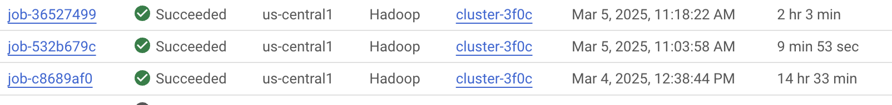

# Batch Gradient Descent

## High Level Overview
In this project, I implemented a Full Batch Gradient Descent job to compute parameters for a regression line to predict
the cost of a taxi trip.

In Task 1, I implemented a simple linear regression using a formula based on solely trip distance. 
Then in task 2, I vectorized the same regression. In task 3, I utilized the trip time, 
trip distance, fare amount, and toll amount to predict the total amount.

## Tasks

### Task 1: Simple Linear Regression 

For this task, I implemented the regression line using a simple formula:


| intercept | trip_distance |
|---|---|
| 8.77918 | 2.3786507 |

It took 46 seconds at the fastest to compute the parameters for this job.

This approach simply emits the necessary values and sums them up. Then, after all
summations are done, I utilize the cleanup() method in the reducer to emit the values for
parameters m and b.

### Task 2: Find the Parameters using Gradient Descent

| intercept | trip_distance |
|---|---|
| 0.45435968139563726 | 2.9692865676266775 |

The parameters for each iteration (as well as some more information) can be
found in this repository in task-2.txt

### Task 3: Fit Multiple Linear Regression using Gradient Descent

| intercept | trip_time_in_secs | trip_distance | fare_amount | tolls_amount |
|---|---|---|---|---|
| 0.09996715263015592 | 0.023326758792849445 | 0.09956516619588494 | 0.09871899600981958 | 0.09983508343625527 |

The parameters for each iteration (as well as some more information) can be
found in this repository in task-3.txt

## Optimizations


As you can probably see, our old jobs used to take 10 minutes, though I reduced this time to
~1 minute by eliminating the work of cleaning the entire dataset every time. By
implementing a mapreduce job that cleans the dataset then using that cleaned dataset for each
job, I discovered that job times shortened by 90%.



As can be seen above, across all of the jobs, I reduced the compute
time from 14.5 hours to just over 2 hours with a cleaning job that took ~10 minutes that would otherwise
be done when each job is submitted.

I additionally achieved parallelization for tasks 2 and 3 by creating a composite
key to allow for aggregation on multiple reducers. I made this discovery primarily by identifying that,
though I had multiple reducer nodes on GCP Dataproc, only one of them was producing output. I created the
composite key (as shown below) by adding a random identifier to the end of the key in the Map phase for each record.


## Learnings

My main learning from this project overall, is that due to MapReduce persisting all data to disk, reading and
extracting that data becomes more difficult to manage in code. There are additionally various forms of passing
data into the jobs, and it seems very arbitrary what the 'right' thing to do is through the API, which definitely sets
the stage for more modern frameworks such as Apache Spark.

## Running on Compute Engine


# Project Template

# Running on Laptop     ####

Prerequisite:

- Maven 3

- JDK 1.6 or higher

- (If working with eclipse) Eclipse with m2eclipse plugin installed


The java main class is:

edu.cs.utexas.HadoopEx.AssignmentDriver

# Running:

To compile our project and create a single jar file with all dependencies: 
	
```	mvn clean package ```

Running as Java Application:

```java -jar target/MapReduce-WordCount-example-0.1-SNAPSHOT-jar-with-dependencies.jar SOME-Text-Fiel.txt output1 output2 logfile2 output3 logfile3``` 

Or as hadoop application

```hadoop jar target/MapReduce-WordCount-example-0.1-SNAPSHOT-jar-with-dependencies.jar edu.cs.utexas.HadoopEx.WordCount output1 output2 logfile2 output3 logfile3```